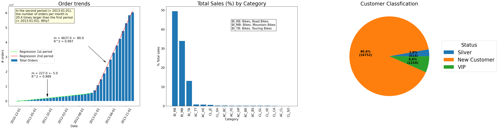

# sql-data-warehouse-project

This project implements a Data Warehouse in SQL Server following the Medallion Architecture (Bronze, Silver, Gold).

The pipeline ingests raw data from CRM and ERP systems, transforms it into structured datasets, and exposes it through a dimensional model (star schema) for analytics and reporting.

## Greetings
I would like to thanks to the Youtube channel DataWithBaraa, which I used to learn about SQL language and get some knowledge about Data Engeneering. A great part of the material presented in this project is extracted from the project course of the channel.
